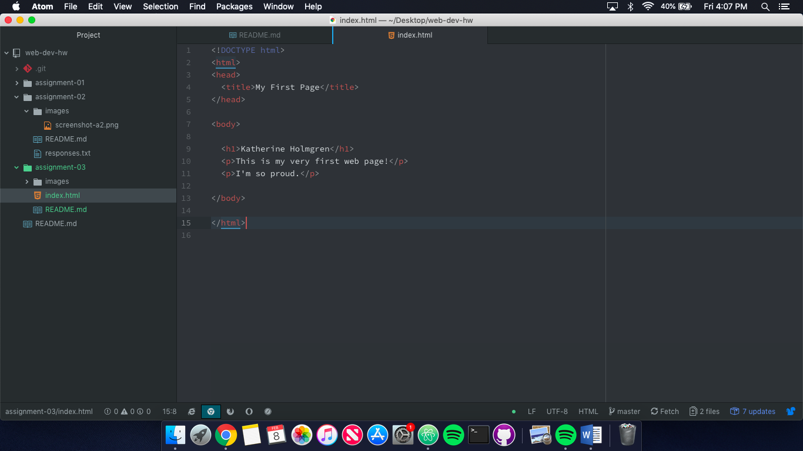

Katherine Holmgren

Assignment 3

## Browsers

A browser is a software that allows a user to access the Internet. Browsers take HTML, CSS, and JavaScript files to display documents on the web. Browsers have a user interface, a rendering engine (displays the visual elements of a page), and a browser engine (connects user interface, rendering engine, and servers). Browsers are connected to the network to receive the files that make up a web page.

I use Google Chrome on my laptop and Safari on my smartphone.

## What is a markup language?

A markup language is used to display text and other content on the web. A common markup language used in development is HTML5 (HyperText Markup Language 5). HTML5 is used to add text content, images, tables, links, and more to web pages.

## Screenshot of index.html

