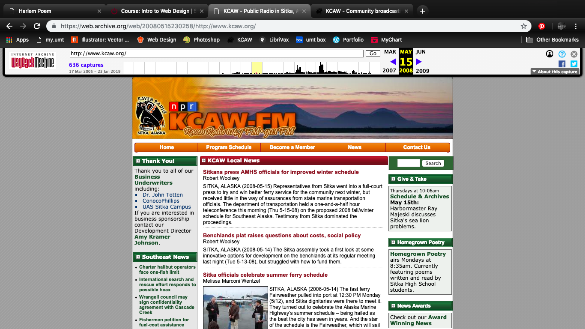

Katherine Holmgren
February 16, 2019

# Assignment 4

## Web Design Over the Years

Using the [Way Back Machine](https://web.archive.org/web/20080515230258/http://www.kcaw.org/), I looked up my hometown's radio station website from May 15th, 2008. The biggest difference I see in the 2008 homepage is less-quality graphic design and layout. Instead of the page taking up the entire browser window like modern websites, it is narrow with blank gray space on either side. There are more headers and less pictures in the old website. It is also more static than the modern website because there is a slide slow, moving elements, and a pop-up subsription box now.

## GitHub Desktop

I used GitHub Desktop in Creative Coding 1 last year so it was not difficult for me. It was hard for me to understand last year, but I'm comfortable with it now and prefer to use it. Version control is very useful when you start projects that take more time and effort. It's also strangely satisfying to push work to GitHub. I'm not sure why.

[KCAW Current Homepage](https://www.kcaw.org/)
