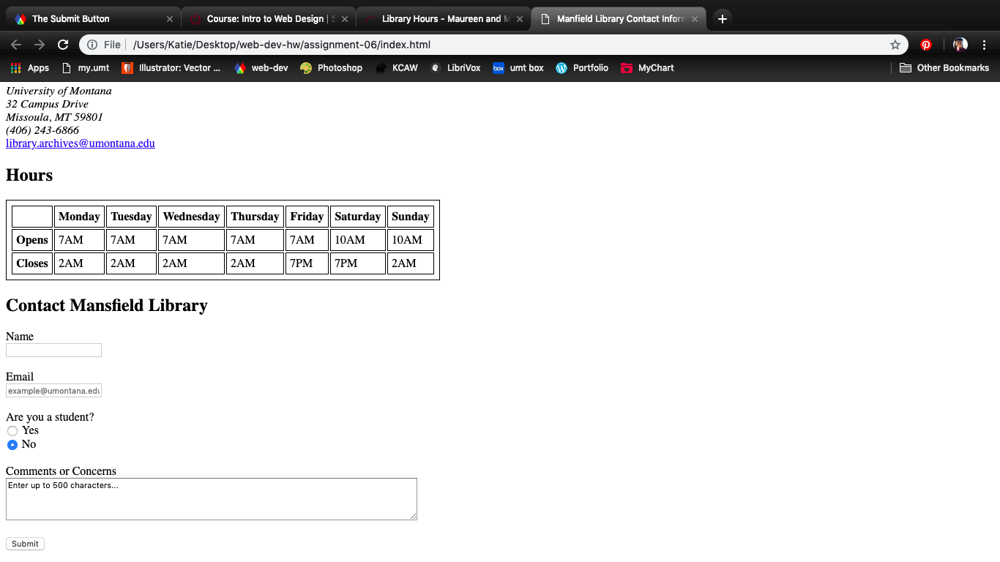

Katherine Holmgren

March 3, 2019

# Assignment 6

[Assignment 6 Live Link](https://katholmgren.github.io/web-dev-hw/assignment-06)

### Describe any forms you've come across while browsing the web. What purposes do they serve?

Contact forms are common. Login pages are forms. Comments and posts on social media are forms. My least favorite type of forms are online quizes.

### List examples of a text, selection, and button input, and where they might be used.

A text input could be a search bar or a text box that asked for your name. A selection input could be a checklist for a quiz or answer buttons for a survey. The button input could be a submit button for a questionaire, a post button for sharing your thoughts on Facebook, or an upload button for your YouTube video.

### Summarize your work cycle for this assignment.

I had a hard time understanding the class work for this week, but doing the homework helped me apply all the concepts. I understand the basics of forms now. I used a lot of copy and paste and a lot of trial and error. I'm finding that constantly going back to my browser to view my index.html is helpful. I chose Mansfield Library because it was the first place that came to mind.

