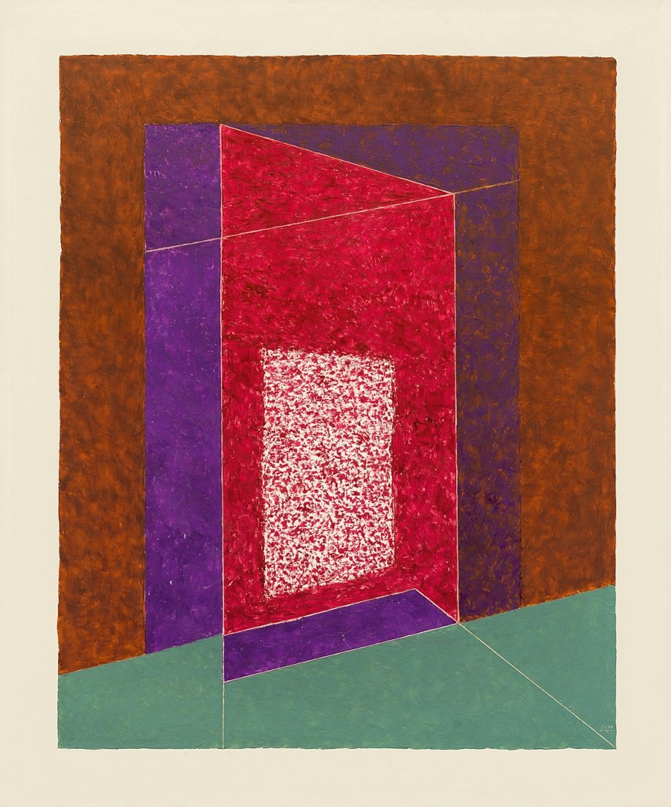

Katherine Holmgren

April 14, 2019

# Assignment 11

[A11 Live Link](https://katholmgren.github.io/web-dev-hw/assignment-11)

### What is the difference between padding, margin, and borders?

Margin sets the distance between the content and the browser window. Padding sets the space between the content and the margin. Borders line the padding to seperate it from the margin.

Concealing by Josef Albers

### Free Response: Summarize your work cycle for this assignment.

I found an image that looked managable and recreated it starting with the canvas. It was a lot of trial and error because positioning is still very hard for me. I find it very frustrating. It worked out okay though.
